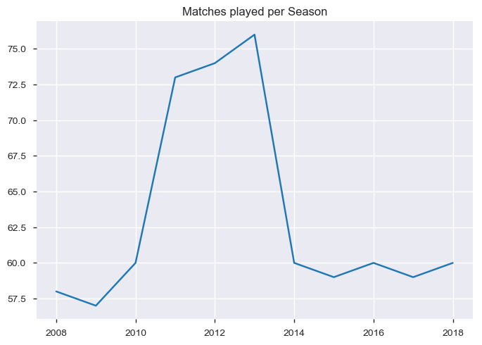
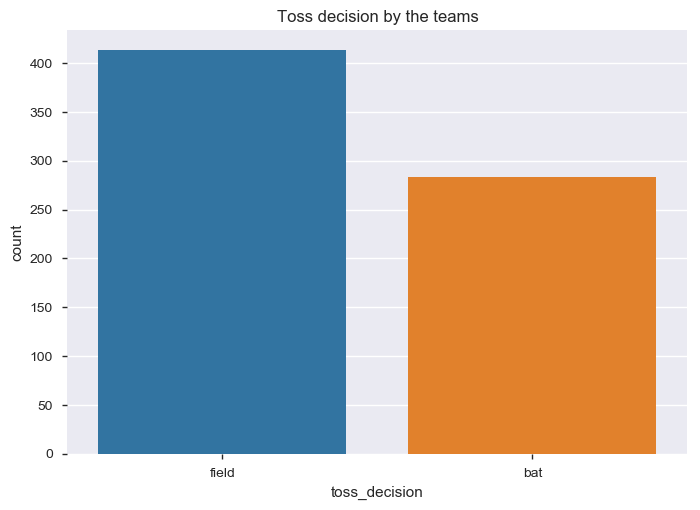
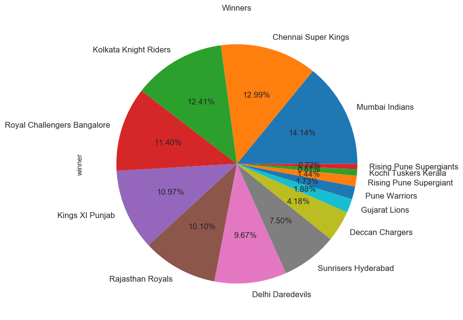
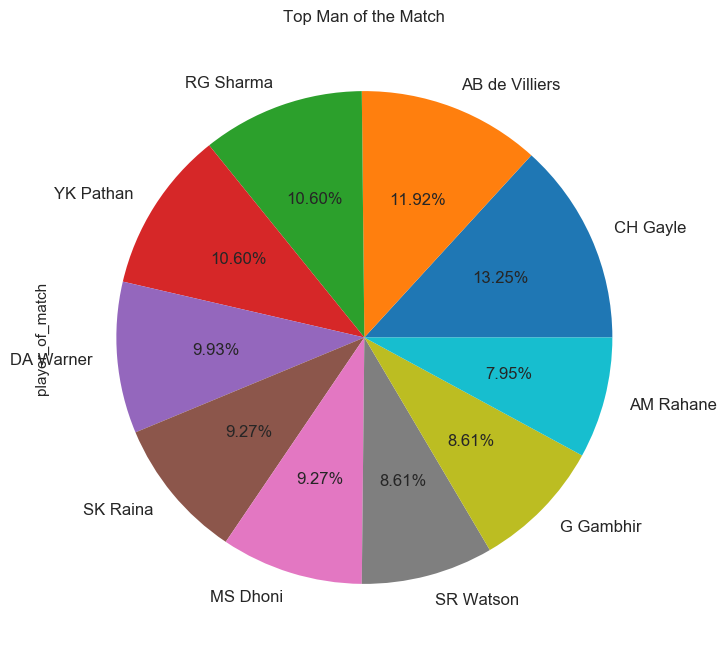

# **IPL** - *DATA ANALYSIS AND VISUALISATION USING PYTHON AND EDA*

## *INTRODUCTION*
The Indian Premier League (IPL) is a professional Twenty20 cricket league in India contested every year by teams representing different cities in India. The league was founded by the Board of Control for Cricket in India (BCCI) in 2008, and is regarded as the brainchild of Lalit Modi, the founder and former commissioner of the league.

The IPL is the most-attended cricket league in the world and in 2014 ranked sixth by average attendance among all sports leagues.In 2010, the IPL became the first sporting event in the world to be broadcast live on YouTube. The brand value of IPL in 2018 was US$6.3 billion, according to Duff & Phelps. According to BCCI, the 2015 IPL season contributed ₹12,543.5 billion to the GDP of the Indian economy.

There have been eleven seasons of the IPL tournament. The current IPL title holders are the Chennai Super Kings, who won the 2018 season.

## *DATA*
The data available with us for 10 seasons which includes the 696 matches played between 2008 to 2017. This data has features as follows:
- Day the match was played
- Season year
- Venue and City of the match
- The two teams playing the match on a particular given day
- Toss Winner and the Toss Decision
- Result of the match (Normal/Tied/Abandoned)
- Match Winner
- Win by Runs/Wickets
- Umpires who officiated the match

## *PROJECT ANALYSIS*
Firstly matches played every year/season were determined. The number of paticipating teams decided the total number of matches played.

Since the dataset had details about the toss decisions. Well, most of the toss wining teams elected to field first and restrict the other team from scoring a ton!

Individual matches won by the teams were determined next. Below is the pie chart visualising the win percentage by each team.

The most successful player of the matches was determined next. Chris Gayle topped the pool with the most Man of the Match awards across 10 seasons.
  

[Jupyter Notebook](./Anant_Term1-IPL.ipynb)
